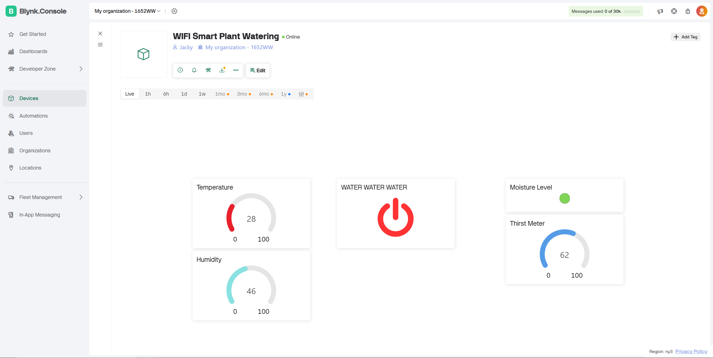

# WIFI Smart Plant Watering System

## Overview
This project is a **smart plant watering system** using an ESP32, a DHT11 temperature/humidity sensor, and a soil moisture sensor. The system monitors plant conditions and allows remote watering control via **Blynk**, a mobile IoT platform.

**Key features:**
- Monitors **temperature, humidity, and soil moisture**.
- Sends real-time data to a **Blynk dashboard**.
- Manual control of a **water pump** via a Blynk button.
- Optional **LED indicator** for soil moisture status.

---

## Hardware Components
| Component | Quantity | Notes |
|-----------|----------|-------|
| ESP32 Development Board | 1 | Main controller |
| DHT11 Sensor | 1 | Measures temperature & humidity |
| Capacitive Soil Moisture Sensor | 1 | Analog + digital outputs |
| Relay Module | 1 | Controls water pump |
| Water Pump | 1 | 3–5V small pump (or appropriate relay-controlled pump) |
---

## Circuit / Wiring

**DHT11**
- VCC → 3.3V  
- GND → GND  
- DATA → GPIO32  

**Soil Moisture Sensor**
- AO → GPIO34 (Analog input, ADC1)  
- DO → GPIO19 (Digital input)  
- VCC → 3.3V  
- GND → GND  

**Relay / Water Pump**
- IN → GPIO33  
- VCC → 3.3V (relay board)  
- GND → GND (common ground with ESP32)  
- COM → pump +
- NO → battery pack +

> ⚠️ Most relay modules are **active LOW**, meaning GPIO LOW = pump ON, HIGH = pump OFF.

---

## Blynk Dashboard Setup

**Gauge Widgets**
- **Temperature** → V2, min 0, max 100°C  
- **Humidity** → V1, min 0, max 100%  
- **Soil Moisture** → V3, min 0, max 100 (analog reading of soil moisture detector)

**Button Widget**
- **Pump control** → V4, push mode  

**LED Widget**
- Soil moisture indicator → V0 (digital reading of soil moisture detector) 

> Make sure Min/Max ranges match your values for both your datastream and the widget; otherwise gauges may only show 0–1.

---

## Notes / Tips
- Use **ADC1 pins (32–39)** for analog sensors; ADC2 pins (0–15) may conflict with Wi-Fi.  
- Check **relay logic**: if the pump turns on when it shouldn’t, invert GPIO logic.  
- Include **common ground** between ESP32 and relay/pump.  

---

## Optional Improvements
- Automatic watering: turn pump ON if soil moisture < threshold.  
- Data logging: send readings to Google Sheets or cloud storage.  
- Multiple plant zones with separate sensors and pumps.

---

## Quick Start
1. Connect all sensors and relay as shown above.  
2. Upload the Arduino code to the ESP32.  
3. Open the Blynk app, add the widgets, and link virtual pins (V0–V4).  
4. Power the ESP32 and check Serial Monitor for sensor readings.  
5. Use the Blynk dashboard to monitor and manually water your plant.

## Future Improvements
1. Automatic watering under the right conditions
2. 3D printed case for to hold the project along with water proofing
